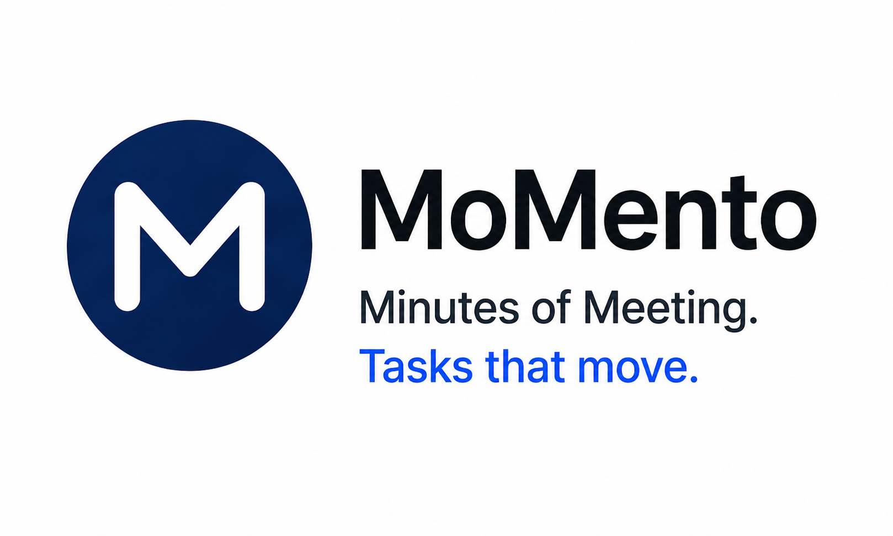

<p align="center">
  
</p>

<p align="center">
  <b>From Meeting Recordings to Structured Action Items — Instantly</b>
</p>

<p align="center">
  
  
  
  
</p>

---

## 🎙️ MoMento

MoMento is an AI-powered meeting intelligence tool that transforms audio recordings into structured, per-person action items in seconds.

Instead of manually reviewing recordings or writing notes, MoMento introduces a fast pipeline:

**Upload recording → Transcribe → Extract tasks per person → Prioritize → Search**

No more replaying meetings. No more missed follow-ups.

---

## 📌 About the Project

Managing meeting outcomes is broken:

- Recordings sit unwatched for days
- Notes are incomplete or missing
- Action items get lost across participants
- No easy way to track who owns what

MoMento addresses this by introducing an intelligent pipeline that:

- Transcribes any meeting audio using ElevenLabs Scribe v2
- Identifies every participant mentioned by name
- Extracts individual tasks and action items per person
- Lets you assign priority levels to every task
- Provides instant search across all participants and tasks

---

## 📱 Screenshots
 *Upload Audio  and Sumrize* 
 

____________________________________________________________________________________________________________________________________________________________________

*Set Priority*

____________________________________________________________________________________________________________________________________________________________________

*Search Teamate*


---

## ⚙️ How It Works

1. User uploads a meeting audio file (`.mp3`, `.wav`, etc.)
2. ElevenLabs Scribe v2 converts speech to a full text transcript
3. Transcript is sent to Groq (LLaMA 3.3 70B) with a structured extraction prompt
4. LLM returns a clean JSON — names, summaries, and task lists per person
5. MoMento renders each participant's card with tasks and priority controls
6. User can search by name or task keyword across all participants

---

## 🧠 AI Pipeline

MoMento is built around a two-stage AI pipeline that separates transcription from understanding.

---

### 1. Transcription Layer (ElevenLabs Scribe v2)

- Accepts audio in mp3, wav, mp4, m4a, ogg, webm
- Returns a full meeting transcript with high accuracy
- Handles multiple speakers and accents

---

### 2. LLM Understanding Layer (Groq + LLaMA 3.3 70B)

- Reads the full transcript
- Identifies every named participant
- Extracts their role, summary, and individual tasks
- Returns structured JSON ready for rendering

---

### 3. Structured Output

```json
{
  "people": [
    {
      "name": "Patrick Therrien",
      "summary": "Mayor, led the meeting and introduced the agenda.",
      "tasks": [
        "Review SiO Silica's file",
        "Discuss council budgets at the staff retreat",
        "Meet with MP Colin Reynolds about the rec center"
      ]
    }
  ]
}
```

---

## ⚡ Core Capabilities

- 🎙️ Audio transcription from real meeting recordings
- 🧠 Per-person task extraction using LLMs
- 🔍 Live search by participant name or task keyword
- 🎯 Priority labelling — High, Medium, Low per task
- 🃏 Clean card-based UI per participant
- ⚡ Single-click — transcribe and summarize in one step

---

## 🛠️ Tech Stack

| Layer | Technology |
|---|---|
| **UI** | Streamlit |
| **Transcription** | ElevenLabs Scribe v2 |
| **LLM** | LLaMA 3.3 70B via Groq |
| **Language** | Python 3.10+ |

---
## 🔭 Future Scope
 
MoMento is built as an MVP — here's where it's headed next.
 
---
 
### 1. Jira & Microsoft Teams Integration
 
- Automatically create Jira tickets from extracted tasks, assigned to the right person with priority already set
- Post a meeting summary card directly into a Microsoft Teams channel after transcription
- No manual copy-paste — tasks flow straight from the meeting into the tools your team already uses
---
 
### 2. Database Integration
 
- Store every meeting, participant, and task in a persistent database
- Full meeting history dashboard — search and revisit past meetings
- Track task completion over time and see who consistently follows through
- Enables analytics — which meetings generate the most action items, which tasks stay unresolved
---
 
### 3. Direct Follow-up Emails from Dashboard
 
- One-click send from the MoMento dashboard
- Each participant receives a personalized email listing only their own tasks and priorities
- No more manually forwarding minutes — MoMento handles the follow-up automatically
---


## 💡 Vision

> Meetings are more than conversations — they're commitments.
>
> MoMento makes sure every commitment is captured, assigned, and prioritized.
